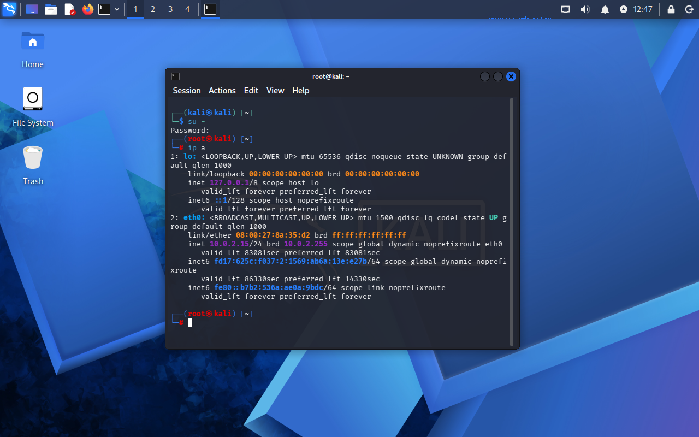
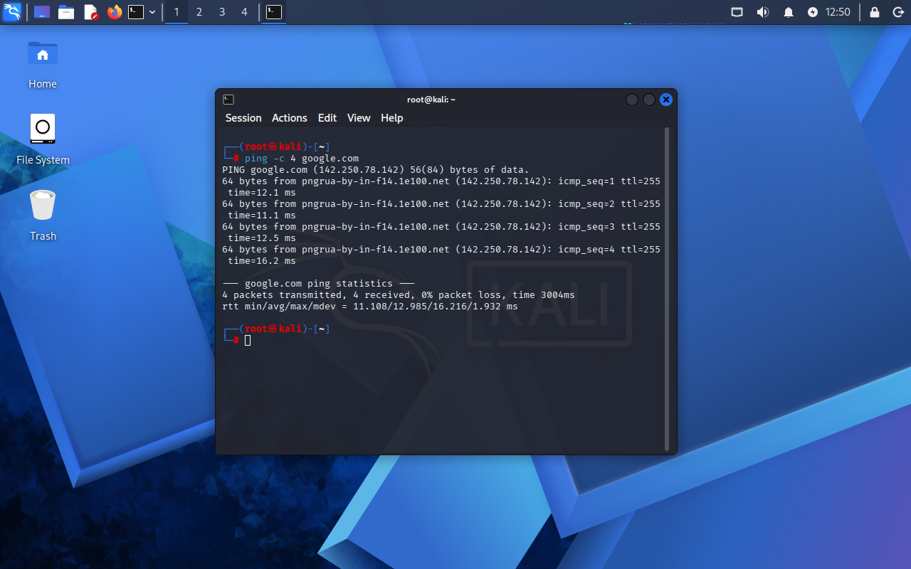

# Lab 01 - Network Discovery

## Objetivo
Identificar o endereço IP da máquina virtual e validar conectividade com a internet.

## Ambiente
- Kali Linux em máquina virtual
- Rede NAT (VirtualBox)

## Comandos utilizados

- ip a  
- ping -c 4 google.com  

## O que os comandos fazem?

### ip a
Exibe informações das interfaces de rede, incluindo o endereço IP da máquina.

### ping -c 4 google.com
Envia 4 pacotes para testar a conectividade com a internet.

## Evidências

### IP da máquina

### Teste de conectividade

## Resultado

Foi possível identificar o IP local da máquina virtual e confirmar acesso à internet com sucesso.

## Análise

A identificação do IP é fundamental para atividades de rede e segurança, pois permite localizar a máquina dentro da rede.

O teste de conectividade garante que a máquina está apta a se comunicar com outros sistemas, o que é essencial para testes de segurança e uso de ferramentas.

## Aprendizado

- Compreensão de IP local  
- Noção de interfaces de rede  
- Teste básico de conectividade  
- Preparação do ambiente para próximos laboratórios  
