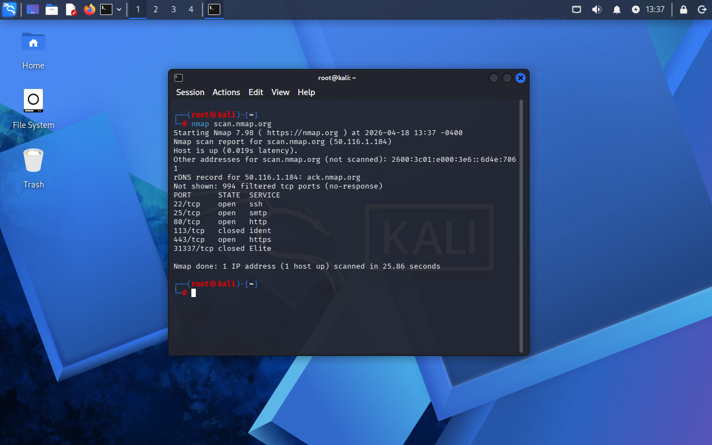

# Lab 02 - Port Scan com Nmap

## Objetivo
Realizar escaneamento de portas em um alvo autorizado para identificar serviços ativos

!!IMPORTANTE (isso é sério)!!

Você NÃO pode sair escaneando qualquer site.

Vamos usar um alvo autorizado:

👉 scanme.nmap.org (feito pra isso)

## Ferramenta utilizada
Nmap

## Comando utilizado

nmap scanme.nmap.org

## Evidência

## Resultado

Foi possível identificar portas abertas e serviços ativos no servidor.

## Aprendizado

Compreensão básica de scan de portas e identificação de serviços em rede.
