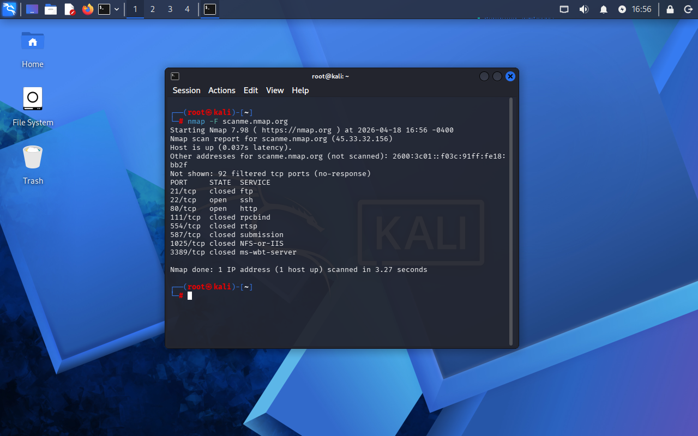

# Lab 03 - Service & Version Detection

## Objetivo
Identificar serviços ativos e suas versões em um alvo autorizado.

## ⚠️ Importante
Este teste foi realizado em ambiente autorizado (scanme.nmap.org).

## Ferramenta utilizada
Nmap

## Comandos utilizados
- nmap -sV scanme.nmap.org
- nmap -F scanme.nmap.org
## O que os comandos fazem?

### nmap -sV
Realiza scan de portas e tenta identificar a versão dos serviços ativos.  
Pode ser mais lento, especialmente em ambientes virtualizados.

### nmap -F
Executa um scan rápido, analisando apenas as portas mais comuns.  
Mais leve e ideal para ambientes com limitação de desempenho.

## Evidência

## Resultado

Foram identificadas portas abertas e serviços ativos no servidor.

Exemplo:

- Porta 22 → SSH  
- Porta 80 → HTTP  

## Análise

A identificação de serviços é essencial para segurança, pois cada porta aberta representa uma possível superfície de ataque.

O scan com detecção de versão (-sV) fornece mais detalhes, porém pode ser mais lento e não finalizar corretamente em ambientes virtualizados.

Por isso, foi utilizado o scan rápido (-F), garantindo execução mais eficiente.

## Aprendizado

- Diferença entre scan completo e scan rápido  
- Impacto de performance em ambientes virtualizados  
- Identificação de serviços ativos  
- Importância da análise de portas abertas  
