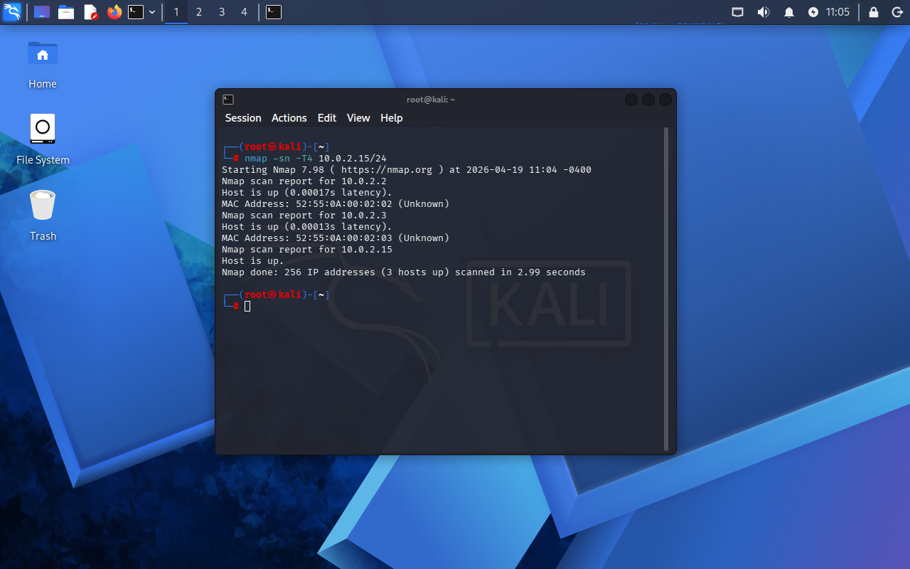

# Lab 04 - Host Discovery e Análise de Rede

## Objetivo
Identificar dispositivos ativos na rede local e compreender sua estrutura.

## Ferramenta utilizada
Nmap

## Comandos utilizados
nmap -sn -T4 10.0.2.0/24
nmap -sn 10.0.2.1-20

## Observação

O comando `nmap -sn -T4 10.0.2.0/24` foi utilizado para realizar a varredura completa da rede.

O comando `nmap -sn 10.0.2.1-20` foi pode ser uma alternativa para otimizar o tempo de execução, porém não foi utilizado na evidência final apresentada.
## O que os comandos fazem?

- `-sn` → realiza descoberta de hosts sem escanear portas  
- `-T4` → aumenta a velocidade do scan  

## Evidência

## Resultado

Foram identificados dispositivos ativos na rede, incluindo:

- Gateway (10.0.2.2)  
- Máquina local (10.0.2.15)  

## Análise

A descoberta de hosts é uma etapa fundamental no reconhecimento de rede.

Esse processo permite identificar quais dispositivos estão ativos e acessíveis, sendo essencial tanto para atividades de pentest quanto para monitoramento de segurança.

No ambiente virtual (VirtualBox NAT), a quantidade de dispositivos encontrados pode ser limitada, o que é esperado nesse tipo de configuração.

## Aprendizado

- Descoberta de dispositivos na rede  
- Identificação de gateway  
- Entendimento de rede em ambiente virtual  
- Uso do Nmap para reconhecimento  
