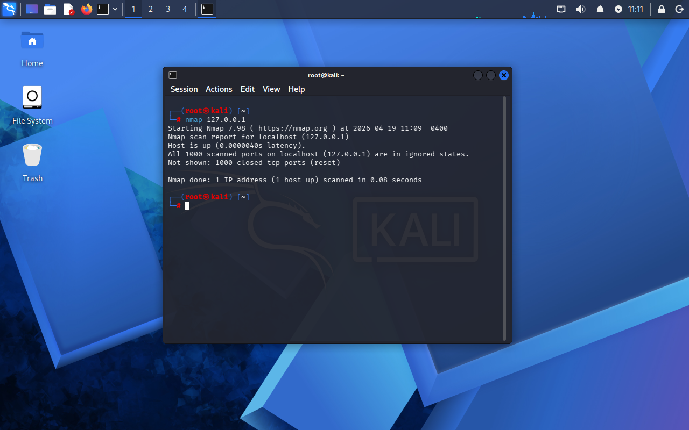
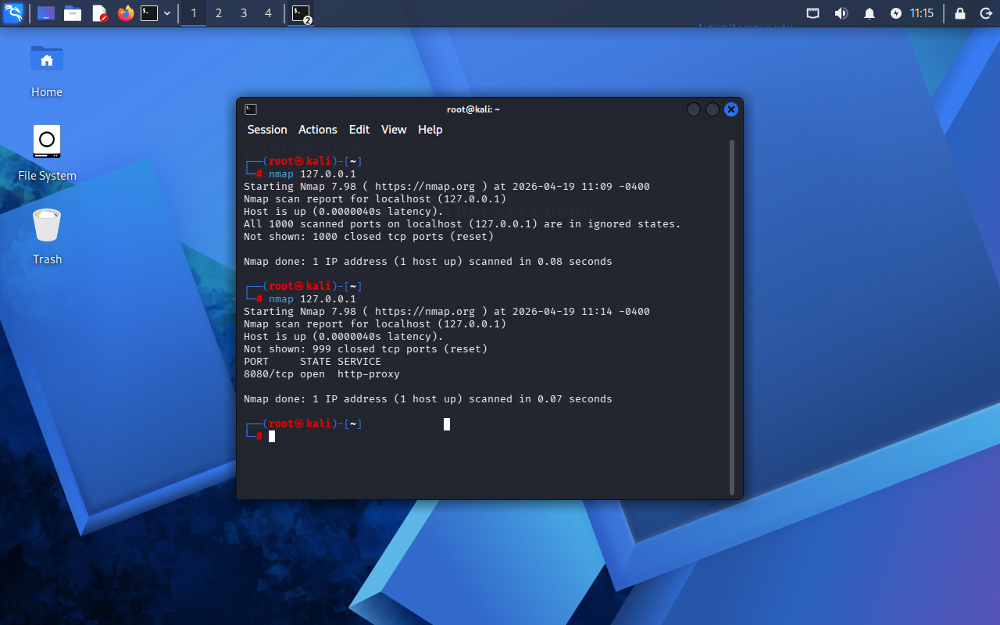

# Lab 05 - Port Scan Local e Análise de Serviços

## Objetivo
Identificar portas abertas na máquina local e analisar o impacto de serviços ativos na superfície de ataque.

## Ferramenta utilizada
Nmap

## Comandos utilizados
- nmap 127.0.0.1
- python3 -m http.server 8080
- nmap 127.0.0.1

## O que os comandos fazem?

- `nmap 127.0.0.1` → realiza scan de portas na máquina local  
- `python3 -m http.server 8080` → inicia um servidor web local na porta 8080  

## Evidência

### Scan sem serviços ativos

### Scan com serviço ativo (porta 8080)

## Resultado

No primeiro scan, não foram identificadas portas abertas, indicando que não havia serviços ativos na máquina.

Após a execução de um servidor local, foi detectada a porta 8080 aberta, indicando a presença de um serviço ativo.

## Análise

A comparação entre os dois cenários demonstra como serviços ativos impactam diretamente a superfície de ataque.

Quando não há serviços rodando, o sistema apresenta menor exposição e reduz significativamente os riscos de acesso não autorizado.

Ao iniciar um servidor local, uma nova porta é aberta, tornando o sistema potencialmente mais vulnerável.

Esse tipo de análise é essencial para compreender como serviços expostos podem representar riscos em ambientes reais.

## Contexto de segurança

Essa prática é utilizada em:

- Hardening de sistemas  
- Auditorias de segurança  
- Testes de vulnerabilidade  
- Monitoramento de serviços ativos  

## Aprendizado

- Identificação de portas abertas  
- Impacto de serviços ativos na segurança  
- Redução da superfície de ataque  
- Uso do Nmap para análise local  
