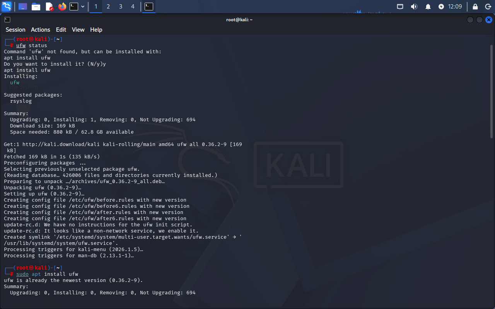
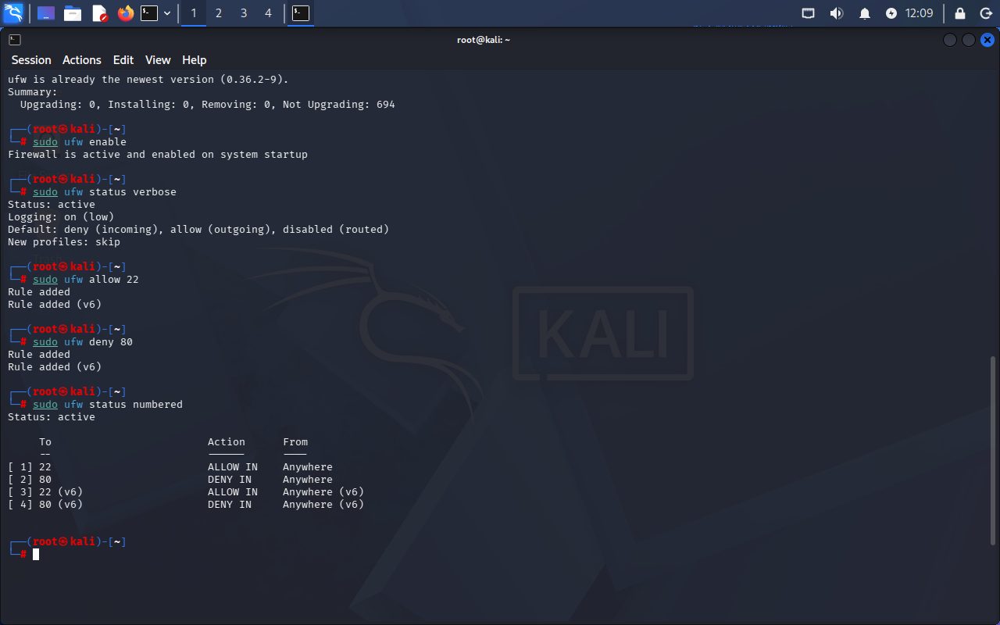

# Lab 06 - Configuração de Firewall com UFW

## Objetivo
Configurar e analisar o firewall do sistema Linux para controle de acesso às portas.

## Ferramenta utilizada
UFW (Uncomplicated Firewall)

## Comandos utilizados
sudo ufw enable
sudo ufw status verbose
sudo ufw allow 22
sudo ufw deny 80
sudo ufw status numbered

## O que os comandos fazem?

- `ufw enable` → ativa o firewall  
- `ufw status` → exibe o status e regras  
- `ufw allow` → permite acesso a uma porta  
- `ufw deny` → bloqueia acesso a uma porta  

## Evidência

As imagens abaixo mostram as regras configuradas no firewall após a aplicação das permissões e bloqueios:

### Regras do firewall (parte 1)

### Regras do firewall (parte 2)

## Resultado

O firewall foi ativado com sucesso e configurado com regras específicas de permissão e bloqueio de portas.

## Análise

A utilização de firewall permite controlar quais portas e serviços podem ser acessados, reduzindo a exposição do sistema.

A liberação apenas de portas necessárias e o bloqueio de serviços desnecessários são práticas essenciais de segurança.

É importante destacar que o firewall não cria portas, apenas controla o acesso às portas existentes no sistema.

## Contexto de segurança

O uso de firewall é fundamental em:

- Hardening de sistemas  
- Proteção contra acessos não autorizados  
- Controle de tráfego de rede  

## Aprendizado

- Configuração de firewall no Linux  
- Controle de acesso por portas  
- Diferença entre portas abertas e controle de acesso  
- Importância da redução da superfície de ataque  
