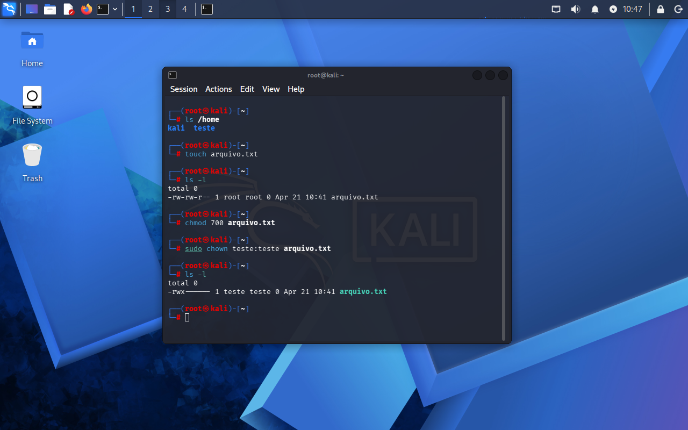

 Lab 07 - Usuários e Permissões no Linux

## Objetivo
Gerenciar usuários e permissões para controle de acesso a arquivos no sistema Linux.

## Ferramentas utilizadas
Comandos nativos do Linux

## Comandos utilizados
- sudo adduser teste
- touch arquivo.txt
- ls -l
- chmod 700 arquivo.txt
- sudo chown teste:teste arquivo.txt
- ls -l
## O que os comandos fazem?

- `adduser` → cria um novo usuário  
- `touch` → cria um arquivo  
- `ls -l` → exibe permissões dos arquivos  
- `chmod` → altera permissões  
- `chown` → altera proprietário do arquivo  

## Entendendo permissões no Linux

Cada número no comando `chmod` representa permissões para um desses grupos.

### Tabela de permissões

| Número | Permissão |
|--------|----------|
| 0 | --- |
| 1 | --x |
| 2 | -w- |
| 3 | -wx |
| 4 | r-- |
| 5 | r-x |
| 6 | rw- |
| 7 | rwx |

### Exemplo prático

- chmod 700 arquivo.txt

Isso significa:

- 7 → dono → rwx (acesso total)  
- 0 → grupo → --- (sem acesso)  
- 0 → outros → --- (sem acesso)  

Resultado:
-rwx------

Apenas o dono do arquivo pode acessar.

## Evidência

## Resultado

Foi criado um usuário e configuradas permissões específicas para um arquivo, restringindo o acesso apenas ao proprietário.

## Análise

O controle de permissões é essencial para garantir que apenas usuários autorizados possam acessar determinados arquivos.

A configuração incorreta de permissões pode permitir acesso indevido a informações sensíveis.

A utilização adequada de usuários e permissões reduz riscos de segurança no sistema.

## Contexto de segurança

Esse controle é fundamental em:

- Hardening de sistemas  
- Proteção de dados sensíveis  
- Controle de acesso interno  

## Aprendizado

- Criação de usuários no Linux  
- Controle de permissões de arquivos  
- Interpretação de permissões (rwx)  
- Importância do princípio do menor privilégio  
