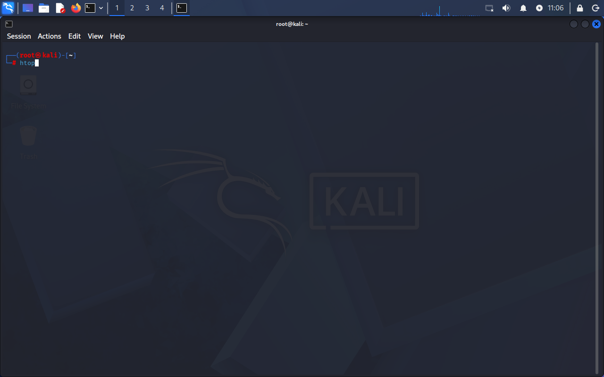
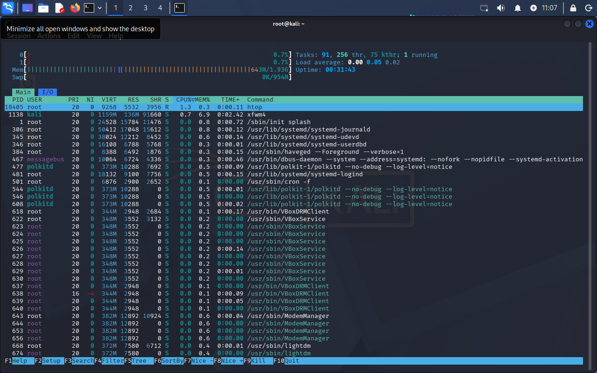

# Lab 08 - Monitoramento de Processos

## Objetivo
Monitorar processos em execução no sistema Linux para identificar atividades, consumo de recursos e possíveis comportamentos suspeitos.

## Ferramentas utilizadas
- Comandos nativos do Linux (`ps`, `top`)
- `htop` (ferramenta de monitoramento avançado)

## Comandos utilizados

ps aux
top
htop
kill PID

## O que os comandos fazem?

- `ps aux` → lista todos os processos em execução no sistema  
- `top` → exibe os processos em tempo real, com uso de CPU e memória  
- `htop` → versão aprimorada do `top`, com interface interativa e mais amigável  
- `kill` → finaliza um processo específico pelo seu PID  

## Sobre o htop

A ferramenta `htop` não vem instalada por padrão em alguns sistemas Linux.

Para instalar, utilize:

-sudo apt install htop

O comando `top` também pode ser utilizado para monitoramento de processos, pois já está disponível por padrão no sistema.

No entanto, neste laboratório foi utilizado o `htop` devido à sua melhor visualização, organização das informações e facilidade de navegação, permitindo uma análise mais clara dos processos em execução em tempo real.

## Evidência

### Inicialização do htop

### Monitoramento de processos em tempo real

## Resultado

Os processos do sistema foram monitorados com sucesso, permitindo visualizar o consumo de CPU, memória e identificar serviços em execução.

## Análise

O monitoramento de processos é essencial para entender o comportamento do sistema e identificar possíveis problemas de desempenho ou atividades anormais.

Ferramentas como `top` e `htop` permitem ao usuário visualizar em tempo real quais processos estão consumindo mais recursos, facilitando a análise e tomada de decisão.

A utilização do `htop` neste laboratório proporcionou uma visualização mais clara e intuitiva, tornando a análise mais eficiente.

## Contexto em Cibersegurança

O monitoramento de processos é uma prática fundamental em cibersegurança, sendo amplamente utilizado por analistas para detecção de atividades suspeitas.

Em um cenário real, ferramentas como `top` ou `htop` podem ser utilizadas para identificar:

- Processos desconhecidos em execução  
- Consumo anormal de CPU ou memória  
- Serviços não autorizados ativos no sistema  

Por exemplo, um processo desconhecido utilizando alta porcentagem de CPU pode indicar a presença de malware, como mineradores de criptomoeda ou backdoors.

Além disso, o monitoramento contínuo permite detectar comportamentos anômalos que podem estar relacionados a invasões ou comprometimento do sistema.

Dessa forma, o uso dessas ferramentas auxilia na detecção inicial de incidentes, permitindo ao analista investigar e responder rapidamente a possíveis ameaças.

## Aprendizado

- Monitoramento de processos em Linux  
- Diferença entre `top` e `htop`  
- Instalação de ferramentas no sistema  
- Identificação de consumo de recursos  
- Aplicação do monitoramento em cenários de cibersegurança  
