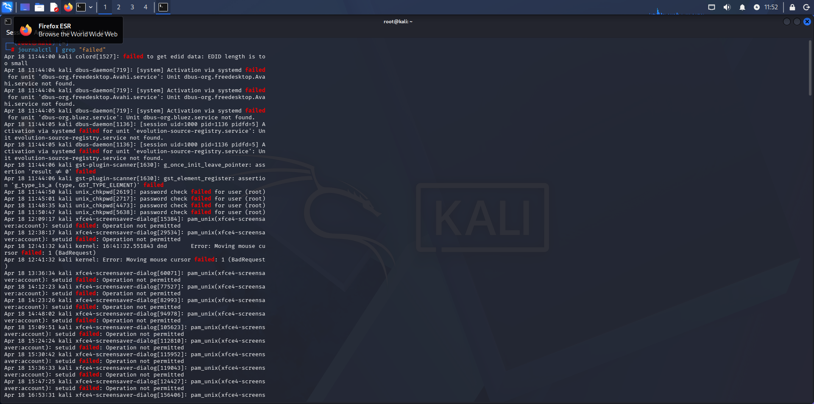

# Lab 09 - Log Analysis

## Objetivo
Analisar logs do sistema Linux para identificar eventos, atividades e possíveis comportamentos suspeitos.

## Ferramentas utilizadas
Comandos nativos do Linux (`journalctl`, `grep`)

## Comandos utilizados
- journalctl
- journalctl | grep "error"
- journalctl | grep "failed"
- journalctl -f

## O que os comandos fazem?

- `journalctl` → exibe logs do sistema gerenciados pelo systemd  
- `grep` → filtra informações específicas dentro dos logs  
- `journalctl -f` → monitora logs em tempo real  

## Observação

Em sistemas modernos como o Kali Linux, os logs não estão disponíveis no arquivo `/var/log/auth.log`.

Nesses casos, é necessário utilizar o `journalctl`, que centraliza os eventos do sistema.

## Evidência

## Resultado

Os logs do sistema foram analisados com sucesso, permitindo identificar eventos de autenticação, erros e possíveis falhas de acesso.

## Análise

A análise de logs é essencial para entender o comportamento do sistema e identificar possíveis atividades suspeitas.

A utilização do comando `grep` facilita a busca por eventos específicos, como erros e falhas, tornando a investigação mais eficiente.

## Contexto em Cibersegurança

Logs são uma das principais fontes de informação em cibersegurança.

Em um cenário real, a análise de logs permite identificar:

- Tentativas de acesso não autorizado  
- Ataques de força bruta  
- Execução de comandos suspeitos  
- Uso indevido de privilégios  

Por exemplo, múltiplas mensagens contendo "failed" podem indicar tentativas repetidas de login sem sucesso.

Isso pode ser um indicativo de ataque de força bruta.

Dessa forma, a análise de logs é fundamental para detecção e resposta a incidentes de segurança.

## Aprendizado

- Uso do `journalctl` para análise de logs  
- Filtragem de eventos com `grep`  
- Identificação de atividades suspeitas  
- Importância dos logs na cibersegurança  
