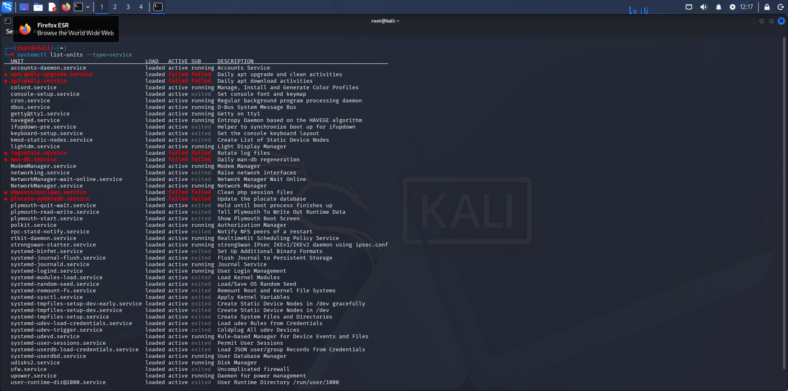
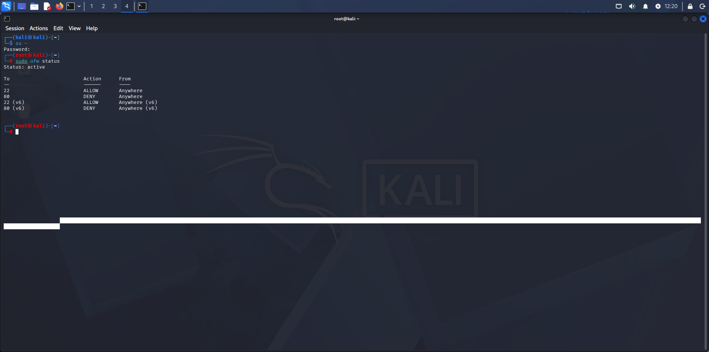

# Lab 10 - Hardening de Sistema

## Objetivo
Aplicar medidas básicas de segurança para reduzir vulnerabilidades em um sistema Linux.

## Ferramentas utilizadas
Comandos nativos do Linux (`apt`, `systemctl`, `ufw`)

## Comandos utilizados

- sudo apt update && sudo apt upgrade -y
- systemctl list-units --type=service
- sudo ufw enable
- sudo ufw status
- sudo systemctl disable <serviço>

## O que os comandos fazem?

- `apt update && apt upgrade -y` → atualiza o sistema e corrige vulnerabilidades conhecidas  
- `systemctl list-units --type=service` → lista os serviços ativos no sistema  
- `ufw enable` → ativa o firewall  
- `ufw status` → exibe o status do firewall  
- `systemctl disable <serviço>` → desativa serviços configurados para iniciar automaticamente  

## Observação

O comando `systemctl disable <serviço>` foi incluído como exemplo de prática de hardening.

Ele pode ser utilizado para desativar serviços desnecessários identificados no sistema, reduzindo a exposição e diminuindo a superfície de ataque.

## Evidência

As imagens abaixo demonstram a verificação de serviços ativos e o status do firewall após a aplicação das medidas de segurança.

### Serviços ativos no sistema

### Status do firewall

## Resultado

Foram aplicadas medidas básicas de segurança, incluindo atualização do sistema, análise de serviços ativos e verificação do firewall.

## Análise

O hardening consiste em reduzir a superfície de ataque do sistema, limitando serviços desnecessários e fortalecendo configurações de segurança.

A análise de serviços ativos permite identificar possíveis pontos de entrada no sistema.

A atualização do sistema corrige vulnerabilidades conhecidas, enquanto o uso do firewall controla o acesso às portas e serviços.

## Contexto em Cibersegurança

O hardening é uma prática essencial em cibersegurança.

Em ambientes reais, ele é utilizado para:

- reduzir vulnerabilidades  
- minimizar exposição a ataques  
- fortalecer a segurança do sistema  
- evitar serviços desnecessários em execução  

Um sistema sem hardening pode manter serviços desnecessários ativos, pacotes desatualizados e maior exposição a ataques.

## Aprendizado

- Aplicação de hardening básico em Linux  
- Importância da atualização do sistema  
- Identificação de serviços ativos  
- Uso do firewall como controle de segurança  
- Redução da superfície de ataque  
